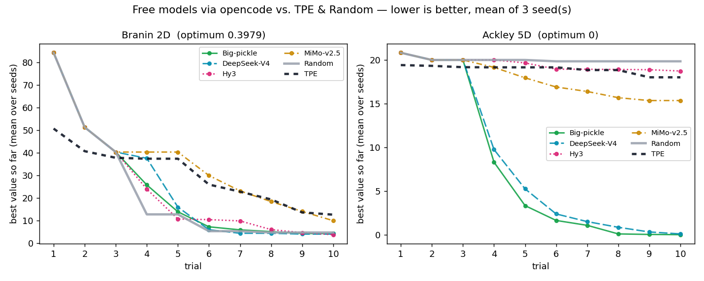
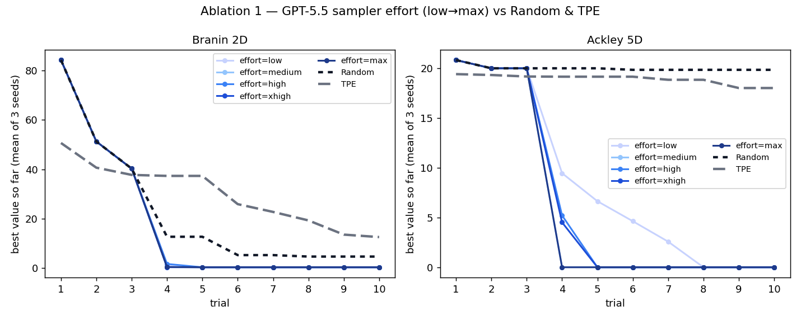
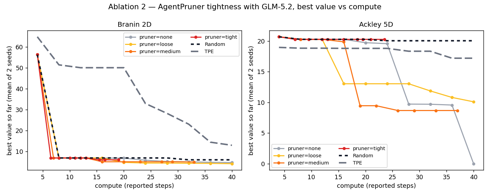

<p align="center">
  <picture>
    <source media="(prefers-color-scheme: dark)" srcset="docs/assets/optim-agent-logo-dark.svg">
    
  </picture>
</p>

# optim-agent

**LLM agents as your hyperparameter optimizer.** Instead of an evolutionary
algorithm or a Bayesian surrogate, optim-agent hands the *choose-the-next-point*
decision to a coding agent (Claude Code, Codex, or OpenCode) that reasons both
**qualitatively** — what a learning rate or a lookback window *means* — and
**quantitatively** — what the trial history *shows*. No API keys, no extra
services: if the agent CLI runs on your machine, optim-agent can drive it.

- **Drop-in study API**: `create_study` / `suggest_float` / `optimize`, familiar
  to anyone who has tuned hyperparameters in Python.
- **Agent samplers at five effort levels** (`low` → `max`): higher effort sees
  more history, reasons explicitly, keeps qualitative notes across trials, and
  ranks multiple candidates.
- **Agent pruners in three levels** (`loose` → `tight`): an agent inspects the
  intermediate learning curve and stops hopeless trials early.
- **Two ways to use it**: a pip package (blackbox, drop-in) or a
  [skill](skills/optim-agent/SKILL.md) where the agent *reads your code* before
  proposing configurations.
- **Zero runtime dependencies** — pure stdlib; agents are called through their
  own CLIs.

**Full documentation:** [docs/index.html](docs/index.html) — served as a
website via GitHub Pages (Settings → Pages → deploy from branch, `main` /`docs`).

## Benchmarks: agents vs. TPE and random search

Two standard test functions — **Branin** (2D) and **Ackley** (5D) — minimized in
a budget of **10 trials**, mean of **3 seeds**. Agents are told only the input
bounds and the trial history, *never the function name*, so they cannot recall a
known optimum. Baselines: uniform **random search** and **Optuna's TPE** (a
classical Bayesian optimizer). Every agent curve is a real run through the
corresponding CLI.

**Headline agents** — Opus-4.8 and GPT-5.5 reach the optimum of both functions
within the budget, well ahead of TPE and random:


**Free models, no paid API** — models served free by opencode are genuinely
competitive. Big-pickle and DeepSeek-V4 solve Ackley-5D outright and beat random
search on Branin. If you're a student or hobbyist without a paid API key, you can
run optim-agent at **zero model cost**:



Best value reached (mean of 3 seeds, lower is better):

| method | backend | Branin → 0.398 | Ackley-5D → 0 |
|---|---|--:|--:|
| Opus-4.8 | claude | **0.40** | **0.00** |
| GPT-5.5 | codex | **0.40** | **0.00** |
| GLM-5.2 | opencode | 4.26 | **0.00** |
| Big-pickle *(free)* | opencode | 4.26 | **0.00** |
| DeepSeek-V4 *(free)* | opencode | 4.02 | 0.09 |
| Hy3 *(free)* | opencode | 3.75 | 18.72 |
| MiMo-v2.5 *(free)* | opencode | 9.94 | 15.34 |
| TPE (baseline) | optuna | 12.60 | 18.00 |
| Random (baseline) | — | 4.72 | 19.83 |

At a 10-trial budget TPE has too little data to fit a useful surrogate, so it
does not yet beat random — which is exactly the low-sample regime where an
agent's prior knowledge pays off. This is a small-budget demonstration (10
trials, 3 seeds, so still noisy); a multi-seed study with more trials and ML
tasks (MNIST, ARIMA) is in the [paper](paper/README.md).

Reproduce from a clone (the `examples` extra pulls in `optuna` for TPE):

```bash
pip install -e ".[examples]"
for s in 0 1 2; do
  python examples/hard_functions.py run --agent Opus-4.8   --seed $s   # claude
  python examples/hard_functions.py run --agent GPT-5.5    --seed $s   # codex (slow: --timeout 600)
  python examples/hard_functions.py run --agent Big-pickle --seed $s   # free, via opencode
  python examples/hard_functions.py run --agent TPE        --seed $s
  python examples/hard_functions.py run --agent Random     --seed $s
done
python examples/hard_functions.py plot        # writes both figures, averaged over seeds
```

opencode's free roster rotates; check `opencode models | grep -E 'free|pickle'`
and swap model ids in `examples/hard_functions.py` as needed. (Some free entries
are too slow to serve as a sampler and are excluded.)

## Ablations

Both ablations fix the model (GLM-5.2 via opencode, free) and vary one knob, on
the same Branin/Ackley functions with Random and TPE for reference
(`python examples/ablations.py plot`).

### Sampler effort



GLM-5.2 at all five efforts (`low`→`max`), best value vs trial, mean of 3 seeds.
**Every effort beats Random and TPE on both functions** — but effort does *not*
produce a clean ranking here: on Branin the cheapest `low` (5-trial history, no
reasoning) is the strongest, on Ackley `high` wins and `xhigh` trails. The five
curves sit inside one seed-noise band. On low-dimensional problems with a
10-trial budget the bottleneck is exploration luck, not reasoning depth, so the
extra history, notes, and ranked candidates that higher effort buys have little
to bite on. Effort is expected to earn its tokens on harder, longer-budget tasks
(the paper's MNIST/ARIMA studies); for cheap objectives, `low` is often enough.

### Pruner tightness



Branin and Ackley are scalar, so there is no learning curve for a pruner to
watch. To exercise pruning we attach a **synthetic** noisy loss curve (four
steps descending toward `f(x)`, with occasional slow-starters) to each
evaluation; the x-axis is **compute (reported steps)**, mean of 2 seeds. A
pruner's payoff is compute saved, so this plots best value vs steps.

Tighter pruning ends at fewer steps — `tight` uses ~20 steps where `none` uses
40, real compute saved. Whether that is worth it depends on the landscape:

- **Branin** (many decent basins): pruning reaches the same ~4–6 quality at
  roughly half the compute — a clear win for `medium`/`tight`.
- **Ackley** (one good region, found late): the winning trial only reveals
  itself near the end, so pruning abandons it — `none` reaches 0.0 while `tight`
  stalls near 20. Aggressive pruning here *hurts*.

Lesson: pruning pays off when doomed trials look bad early and good trials reveal
themselves early. It backfires on late-blooming optima. Prefer `loose` or no
pruning unless each evaluation is genuinely expensive and its early signal is
reliable.

```bash
for s in 0 1 2; do
  for e in low medium xhigh max; do python examples/ablations.py effort --variant $e --seeds $s; done
done
for s in 0 1; do
  for p in loose medium tight; do python examples/ablations.py prune --variant $p --seeds $s; done
done
python examples/ablations.py plot   # reuses the GLM-5.2/Random/TPE curves above
```

## Install

```bash
pip install optim-agent
```

Plus at least one agent CLI on your PATH, already authenticated:
[claude](https://docs.anthropic.com/en/docs/claude-code),
[codex](https://github.com/openai/codex), or
[opencode](https://github.com/sst/opencode).

## Quickstart

```python
import optim_agent as oa

def objective(trial):
    lr = trial.suggest_float("lr", 1e-5, 1e-1, log=True,
                             context="learning rate for training an image classifier")
    batch = trial.suggest_int("batch", 8, 256, log=True,
                              context="mini-batch size; larger is more stable but slower")
    return train_and_validate(lr, batch)          # your code

study = oa.create_study(
    direction="minimize",
    sampler=oa.AgentSampler(
        backend="claude",                          # or "codex" / "opencode"
        effort="high",                             # low | medium | high | xhigh | max
        context="a CNN on MNIST",                  # study-wide description (optional)
    ),
    storage="study.json",                          # optional: persist & resume
)
study.optimize(objective, n_trials=20)
print(study.best_value, study.best_params)
```

`context` is optional but powerful: it tells the agent what the parameters
*are*, so it can reason like a practitioner ("loss diverged at lr=0.1 with a
small batch — try 3e-4 and a larger batch") instead of a blind point-picker.
Set it study-wide on `AgentSampler(context=...)`, per-parameter on each
`suggest_*(..., context=...)`, or both — every piece is shown to the agent.

### Sampler effort

| effort | history shown | explicit reasoning | qualitative notes | candidates |
|---|---|---|---|---|
| `low` | last 5 trials | – | – | 1 |
| `medium` | last 15 trials | – | – | 1 |
| `high` | all | ✓ | – | 1 |
| `xhigh` | all | ✓ | ✓ carried across trials | 1 |
| `max` | all | ✓ | ✓ carried across trials | 3, ranked |

Higher effort spends more tokens per trial. If your objective is expensive
(minutes of training per trial), `max` is cheap by comparison; for fast
objectives, `low` or plain `RandomSampler()` may be all you need.

### Pruning

```python
study = oa.create_study(
    sampler=oa.AgentSampler(backend="codex"),
    pruner=oa.AgentPruner(backend="codex", level="medium"),  # loose | medium | tight
)

def objective(trial):
    lr = trial.suggest_float("lr", 1e-5, 1e-1, log=True,
                             context="learning rate for training an image classifier")
    for epoch in range(20):
        loss = train_one_epoch(lr)
        trial.report(loss, epoch)
        if trial.should_prune():
            raise oa.TrialPruned()
    return loss
```

The pruner agent compares the current learning curve against completed trials
and answers prune/keep; `loose` intervenes only on hopeless runs, `tight`
kills anything underperforming. It never prunes on an agent error.

### Concurrency & distributed studies

Set `max_concurrency` (default `1`) to evaluate several trials at once, and use
a SQLite `storage` file (`.db` / `.sqlite`) as the concurrency-safe shared
history:

```python
study = oa.create_study(
    sampler=oa.AgentSampler(backend="claude"),
    storage="study.db",        # SQLite → safe for many workers; .json stays single-writer
    max_concurrency=8,         # up to 8 objectives run at once
)
study.optimize(objective, n_trials=100)
```

- **Within a process**, `max_concurrency` runs objectives in a thread pool. The
  agent sampling queries are **queued** (serialized) so each proposal sees the
  in-process history; only your `objective` runs in parallel — ideal when it is
  I/O- or subprocess-bound (training a model, hitting an API).
- **Across processes / machines**, point them all at the same SQLite `storage`.
  The database *is* the communication channel: WAL mode lets every worker append
  results and read history without clobbering, and trial numbers stay unique.

Ceilings (deliberate): threads share the GIL, so pure-Python CPU-bound
objectives won't speed up — spread those over processes via shared SQLite
instead. Concurrent workers don't see each other's *in-flight* points, so they
may occasionally probe nearby regions; that is the normal cost of parallel HPO.

### Skill mode (agent reads your code)

The pip package treats your objective as a blackbox. The
[optim-agent skill](skills/optim-agent/SKILL.md) goes further: installed into a
coding-agent session, the agent first *reads your project* to understand each
hyperparameter's role, then drives the same study loop itself via
`study.ask(params)` / `study.tell(trial, value)` — with the study JSON keeping
history across sessions.

```python
trial = study.ask({"lr": 3e-4, "batch": 64})   # the session agent picks the point
study.tell(trial, run_training(**trial.params))
```

### Offline testing

`AgentSampler(backend="mock")` is a token-free stand-in (hill climbing around
the best point) so you can wire everything up before spending agent calls.

## Troubleshooting

- **`claude` returns 401 inside an agent session** — nested sessions inherit
  `ANTHROPIC_API_KEY`; run with `env -u ANTHROPIC_API_KEY` or from a clean shell.
- **A backend call times out or emits garbage** — the sampler warns and falls
  back to a random point for that trial; the study keeps going.

## Paper

An arXiv paper with extended experiments (MNIST classification, ARIMA
time-series fitting, baseline and ablation studies) is in preparation under
[`paper/`](paper/README.md).

## License

[MIT](LICENSE)
