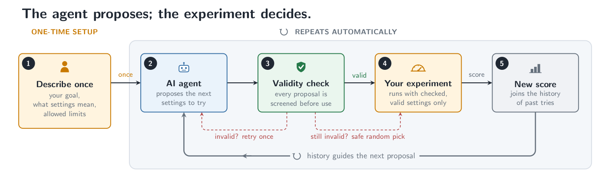
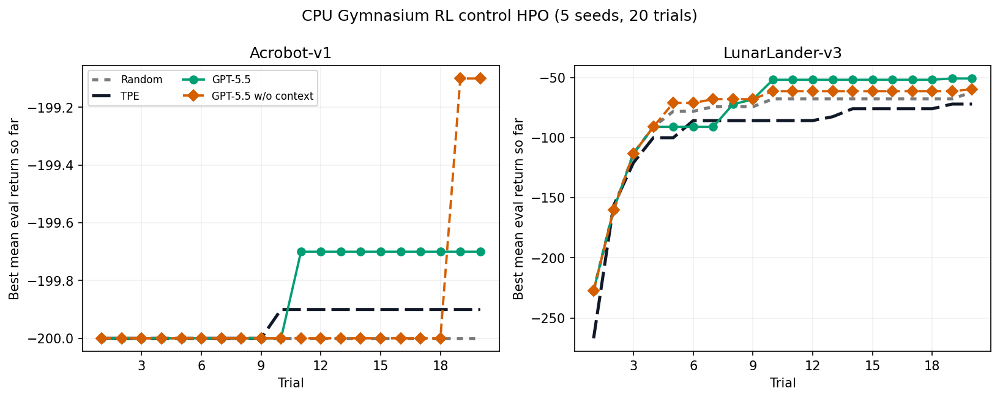
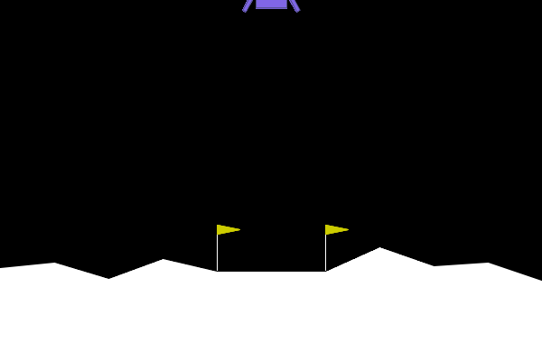

<p align="center">
  <picture>
    <source media="(prefers-color-scheme: dark)" srcset="docs/assets/optim-agent-logo-dark.svg">
    
  </picture>
</p>

<h1 align="center">optim-agent</h1>

<p align="center">
  <strong>Agentic system optimization with coding agents.</strong><br>
  Automate the iterative parameter-tuning work of an algorithm engineer.
</p>

<p align="center">
  <a href="https://pypi.org/project/optim-agent/"></a>
  <a href="https://pypi.org/project/optim-agent/"></a>
  <a href="LICENSE"></a>
  
</p>

<p align="center">
  <strong>English</strong> |
  <a href="docs/i18n/README_ZH.md">简体中文</a> |
  <a href="docs/i18n/README_JA.md">日本語</a> |
  <a href="docs/i18n/README_KO.md">한국어</a> |
  <a href="docs/i18n/README_FR.md">Français</a> |
  <a href="docs/i18n/README_DE.md">Deutsch</a> |
  <a href="docs/i18n/README_ES.md">Español</a> |
  <a href="docs/i18n/README_PT.md">Português</a> |
  <a href="docs/i18n/README_RU.md">Русский</a>
</p>

<p align="center">
  <a href="https://optim-agent.github.io/optim-agent/">Documentation</a>
</p>

optim-agent uses Claude Code, Codex, or OpenCode to optimize any system that
exposes **configurable parameters** and a **measurable objective**. It combines
what each parameter *means* with what the trial history *shows*, then proposes
the next configuration to evaluate. Objective evaluations remain authoritative:
optim-agent proposes values, validates them against the declared space, records
outcomes, and falls back to safe sampling when an agent reply is invalid.

<p align="center">
  
</p>

| Models | Systems | Research |
|---|---|---|
| Training, architecture, and RL experiments | Inference, latency, cost, control, and decision rules | Quant signals, simulations, and scientific workflows |

<p align="center"><a href="#install"><code>pip install optim-agent</code></a></p>

## Why optim-agent

- **Semantic proposals** - coding agents reason over parameter meanings, study
  context, and observed outcomes instead of treating every dimension as an
  anonymous coordinate.
- **Small-budget leverage** - useful when evaluations are expensive and classical
  surrogates are still data-starved.
- **Agent CLI upside** - proposal quality can improve as the underlying coding
  agents improve, such as moving from GPT-5.5 to GPT-5.6, without changing your
  optimization code.
- **Auditable decisions** - JSON/SQLite studies retain configurations,
  outcomes, states, context, and optional agent rationale.
- **Bounded execution** - the agent only proposes values; optim-agent validates
  them against the declared space, and invalid output falls back to safe
  sampling.

## Install

Install from PyPI or GitHub:

```bash
# Stable release from PyPI
python -m pip install optim-agent

# Latest source from GitHub
python -m pip install "optim-agent @ git+https://github.com/Optim-Agent/optim-agent.git"
```

Requires one authenticated agent CLI on `PATH`:
[claude](https://docs.anthropic.com/en/docs/claude-code),
[codex](https://github.com/openai/codex), or
[opencode](https://github.com/sst/opencode).

## Quickstart

```python
import optim_agent as oa

def objective(trial):
    threshold = trial.suggest_float(
        "threshold", 0.05, 0.95,
        context="decision threshold; higher values trade recall for precision",
    )
    budget = trial.suggest_int(
        "budget", 10, 200, log=True,
        context="compute or operating budget; larger values may improve quality",
    )
    return evaluate_system(threshold=threshold, budget=budget)  # domain code

study = oa.create_study(
    direction="maximize",
    sampler=oa.AgentSampler(
        backend="claude",  # or "codex" / "opencode"
        effort="high",
        context="maximize system quality under a strict operating-cost budget",
        history=5,
        explicit_reasoning=True,
        qualitative_notes=True,
    ),
    storage="study.json",  # optional: persist and resume
)
study.optimize(objective, n_trials=20)
print(study.best_value, study.best_params)
```

Optional `context` gives domain meaning to the study and parameters. Provide it
study-wide on `AgentSampler(context=...)`, per parameter on
`suggest_*(..., context=...)`, or both.

## Where It Applies

| Area | Parameters optim-agent can tune | Example objective |
|---|---|---|
| **Model training** | learning rates, architectures, augmentation, regularization | validation quality, compute, robustness |
| **Inference and serving** | quantization, batching, decoding, caching, routing | quality, latency, throughput, cost |
| **Quantitative research** | signal windows, thresholds, rebalance rules, risk controls | walk-forward return, drawdown, turnover |
| **Reinforcement learning and decisions** | objective weights, exploration schedules, environment settings, policy thresholds | return, safety, sample efficiency |
| **Scientific workflows** | simulation inputs, solver settings, experimental controls | fit, error, runtime, resource use |
| **Black-box systems** | any bounded categorical, integer, or continuous configuration | scalar objective score |

For reinforcement learning, optim-agent tunes the system around the learning
loop; it does not replace the policy-learning algorithm.

## Optimization Trajectory


This seed-0 Branin trace compares TPE and GPT-5.5 under the same 10-trial
budget, with incumbent objective values after each trial. It is a trajectory
illustration; aggregate benchmark results and reproduction commands follow.

### Optimizing Math Functions without Context: Branin-2D and Ackley-5D

Hard-function agents receive **no supplied task context**: only generic
`x1...x5` parameter names, numeric bounds, and trial history. Runs use 10 trials
over five seeds; Random and TPE are unchanged baselines.

#### Top-tier Agents


| method       | mean best Branin ↓ | mean best Ackley-5D ↓ |
| ------------ | -----------------: | --------------------: |
| Random       |              5.008 |                19.639 |
| TPE          |             11.395 |                18.843 |
| GPT-5.5      |              1.326 |                 3.960 |
| **Opus-4.8** |          **0.398** |             **0.061** |
| Sonnet-5     |              3.850 |                 0.143 |
| GLM-5.2      |              3.609 |                15.023 |

The pinned models are `gpt-5.5`, `claude-opus-4-8`, `claude-sonnet-5`, and
`glm-5.2`.
Opus-4.8 reaches the Branin optimum on average and has the strongest five-seed
Ackley mean.

#### OpenCode Agents (Free)


| method                | mean best Branin ↓ | mean best Ackley-5D ↓ |
| --------------------- | -----------------: | --------------------: |
| Random                |              5.008 |                19.639 |
| TPE                   |             11.395 |                18.843 |
| Big-pickle            |              4.734 |                15.951 |
| **DeepSeek-V4-Flash** |              4.410 |             **4.608** |
| Nemotron-3-Ultra      |             16.051 |                18.459 |
| **MiMo-v2.5**         |          **3.682** |                15.597 |

OpenCode-hosted models require no paid model API. The free pool rotates; this
refresh pins `opencode/big-pickle`, `opencode/deepseek-v4-flash-free`,
`opencode/nemotron-3-ultra-free`, and `opencode/mimo-v2.5-free`. DeepSeek V4
Flash has the strongest free-model Ackley mean, while MiMo-v2.5 has the
strongest free-model Branin mean.

### Tuning ResNet-based Image Classifier: MNIST and CIFAR-10

The classification benchmark compares **Random**, Optuna **TPE**,
**GPT-5.5 w/ context**, and **GPT-5.5 w/o context** over five seeds (`0..4`) and
10 trials. The context condition receives natural-language study and parameter
descriptions; the no-context condition receives only bounds and trial history.

For classification, the primary metric emphasizes fast improvement:

```text
cumulative_best_so_far_error = sum(best_test_error_so_far_at_i for i in 1..10)
```

Lower is better.


| method                 | MNIST cumulative error ↓ | MNIST final error ↓ | CIFAR-10 cumulative error ↓ | CIFAR-10 final error ↓ |
| ---------------------- | -----------------------: | ------------------: | --------------------------: | ---------------------: |
| Random                 |                    9.174 |              0.648% |                     278.920 |                25.072% |
| TPE                    |                    7.166 |              0.580% |                     279.936 |                25.596% |
| **GPT-5.5 w/ context** |                **5.668** |          **0.506%** |                 **220.994** |            **21.322%** |
| GPT-5.5 w/o context    |                    8.910 |              0.632% |                     281.466 |                25.960% |

GPT-5.5 w/ context reduces cumulative best-so-far error by **20.9%** relative to
TPE on MNIST and by **20.8%** relative to Random on CIFAR-10. Without context,
it is 24.3% worse than TPE on MNIST and 0.9% worse than Random on CIFAR-10. The
gap includes both semantic parameter information and earlier access to
agent-guided proposals.

Both [`examples/mnist.py`](examples/mnist.py) and
[`examples/cifar10.py`](examples/cifar10.py) tune learning rate, batch size,
weight decay, label smoothing, three stage widths, three stage depths, and four
dropout controls. MNIST adds translation and rotation; CIFAR-10 uses crop
padding and flip probability.

### Tuning Q-learning Controllers: Acrobot-v1 and LunarLander-v3



This CPU-only Gymnasium benchmark tunes a discretized Q-learning controller for
Acrobot-v1 and LunarLander-v3. Each method runs 20 trials over five seeds
(`0..4`); the objective is mean evaluation return, so higher is better. The
runner parallelizes across seeds and within each HPO study via `--workers`.
The GPT-5.5 arms use high modeling effort and the last 5 trials of history. The
winning contextual arm disables the optional explicit-reasoning and qualitative-note fields.

| method                 | Acrobot-v1 return ↑ | LunarLander-v3 return ↑ |
| ---------------------- | ------------------: | ----------------------: |
| Random                 |            -200.000 |                 -62.139 |
| TPE                    |            -199.900 |                 -72.088 |
| **GPT-5.5 w/ context** |        **-199.700** |             **-50.825** |
| GPT-5.5 w/o context    |            -199.100 |                 -59.751 |

With 20 trials and a five-trial prompt history, GPT-5.5 w/ context has the
strongest mean return on both environments: 0.2 above TPE on Acrobot-v1 and
11.3 above Random on LunarLander-v3. Treat this as a CPU HPO stress test rather
than a universal ranking.

For the animation, optim-agent tunes seven gains of a deterministic
LunarLander controller using one HPO seed. Each trial runs on the same 20
rollout seeds, prioritizing the number of successful landings and then mean
return. A landing succeeds when Gymnasium terminates with the lander at rest
and a final signal of +100. The selected trial landed in all 20 rollouts; the
GIF shows its highest-return rollout.



### Tuning Gradient Boosting Classifier: Credit-default Probabilities


This CPU-only benchmark tunes eight training parameters of a
`HistGradientBoostingClassifier` on UCI's
[Default of Credit Card Clients](https://archive.ics.uci.edu/dataset/350/default+of+credit+card+clients)
dataset: 30,000 rows, 23 features, and a next-month default target. The official
archive is pinned by SHA-256, licensed CC BY 4.0, and split once into 60% train,
20% validation, and 20% untouched test data. All methods use the same split, 20
trials, and seeds `0..4`. Both GPT-5.5 arms use high modeling effort, 20 trials
of prompt history, explicit reasoning, and qualitative notes.

| method                 | final validation log loss ↓ | held-out test log loss ↓ |
| ---------------------- | --------------------------: | -----------------------: |
| Random                 |                       0.433 |                    0.425 |
| TPE                    |                       0.430 |                    0.422 |
| **GPT-5.5 w/ context** |                   **0.428** |                **0.422** |
| GPT-5.5 w/o context    |                       0.433 |                    0.427 |

Context lowers final validation log loss by 1.13% and test log loss by 1.23%
relative to the matched no-context control. GPT-5.5 also beats Random and TPE
on both reported metrics. Because the retained configuration was selected using
both validation and test loss, the test result is a benchmark comparison rather
than an untouched estimate of generalization.

This is a methodological benchmark, not a production credit-decision system.
Deployment would require fairness, calibration, drift, governance, and legal
review beyond this experiment.

Reproduce the benchmark artifacts:

```bash
pip install -e ".[examples]"

# Classification
python scripts/verify_classification_cumulative_error.py run-no-context
python scripts/verify_classification_cumulative_error.py

# Hard functions
python examples/hard_functions.py preflight
python examples/hard_functions.py distributed --trials 10 --seeds 0 1 2 3 4
python examples/hard_functions.py plot

# Credit-card HGB
pip install -e ".[ml,examples]"
python examples/credit_card.py download
python examples/credit_card.py preflight
python examples/credit_card.py run
python examples/credit_card.py selfcheck
python examples/credit_card.py summary
python examples/credit_card.py plot

# RL control
pip install -e ".[rl,examples]"
python examples/rl_control.py preflight
python examples/rl_control.py run --seeds 0 1 2 3 4 --workers 10
python examples/rl_control.py selfcheck
python examples/rl_control.py summary
python examples/rl_control.py plot
python examples/rl_control.py gif
```

## Usage Guide

### Sampler Prompt Controls

`effort` is forwarded to the backend CLI's reasoning-effort flag. The harness
prompt is controlled separately:

```python
oa.AgentSampler(
    backend="codex",
    effort="medium",
    history=5,
    explicit_reasoning=True,
    qualitative_notes=True,
)
```

Set `history=None` to show all completed/pruned trials. Use
`explicit_reasoning=False` or `qualitative_notes=False` for shorter agent
replies.

### Pruning

```python
study = oa.create_study(
    sampler=oa.AgentSampler(backend="codex"),
    pruner=oa.AgentPruner(
        backend="codex", level="medium", effort="medium",
    ),  # level: loose | medium | tight
)

def objective(trial):
    lr = trial.suggest_float("lr", 1e-5, 1e-1, log=True,
                             context="learning rate for training an image classifier")
    for epoch in range(20):
        loss = train_one_epoch(lr)
        trial.report(loss, epoch)
        if trial.should_prune():
            raise oa.TrialPruned()
    return loss
```

The pruner agent compares the current learning curve against completed trials
and answers prune/keep; `loose` prunes only clearly underperforming runs,
while `tight` prunes aggressively. Agent errors never prune a trial.

### Concurrency & Distributed Studies

Set `max_concurrency` (default `1`) to evaluate several trials at once, and use
a SQLite `storage` file (`.db` / `.sqlite`) as the concurrency-safe shared
history:

```python
study = oa.create_study(
    sampler=oa.AgentSampler(backend="claude"),
    storage="study.db",        # SQLite → safe for many workers; .json stays single-writer
    max_concurrency=8,         # up to 8 objectives run at once
)
study.optimize(objective, n_trials=100)
```

- **Within a process**, `max_concurrency` runs objectives in a thread pool. The
  agent sampling queries are **queued** (serialized) so each proposal sees the
  in-process history; only objective calls run in parallel. This works best for
  I/O- or subprocess-bound evaluations such as model training or API calls.
- **Across processes / machines**, point them all at the same SQLite `storage`.
  The database *is* the communication channel: WAL mode lets every worker append
  results and read history without write conflicts, and trial numbers stay
  unique.

Limitations: threads share the GIL, so pure-Python CPU-bound objectives run
best in separate processes with shared SQLite storage. Concurrent workers do
not see each other's *in-flight* points, so they may occasionally probe nearby
regions.

### Skill Mode (Agent Reads Project Code)

The pip package treats the objective as a black box. The
[optim-agent skill](SKILL.md) goes further: loaded in a
coding-agent session, the agent first *reads the project* to understand each
parameter's role, then drives the same study loop itself via
`study.ask(params)` / `study.tell(trial, value)` — with the study JSON keeping
history across sessions.

```text
$skill-installer install https://github.com/Optim-Agent/optim-agent
```

Claude Code plugin:

```bash
claude plugin marketplace add Optim-Agent/optim-agent
claude plugin install optim-agent@optim-agent
```

Codex plugin:

```bash
codex plugin marketplace add Optim-Agent/optim-agent
codex plugin add optim-agent@optim-agent
```

```python
trial = study.ask({"threshold": 0.72, "budget": 80})
study.tell(trial, evaluate_system(**trial.params))
```

### Offline Testing

`AgentSampler(backend="mock")` is a token-free stand-in (hill climbing around
the best point) for testing integrations before agent calls.

## Troubleshooting

- **`claude` returns 401 inside an agent session** — nested sessions inherit
  `ANTHROPIC_API_KEY`; run with `env -u ANTHROPIC_API_KEY` or from a clean shell.
- **A backend call times out or emits invalid output** — the sampler warns and
  falls back to a random point for that trial; the study keeps going.
- **OpenCode with distributed studies** — OpenCode currently does not support distributed computing
  in optim-agent; use the single-process workflow or a
  different backend for distributed runs.

## Contributing

Contributions are welcome. To develop locally:

```bash
pip install -e ".[examples]"
pytest                     # runs tests/test_optim_agent.py
```

Please open an issue to discuss larger changes before sending a PR. Adding a new
agent backend usually means one small function in [`optim_agent/agent.py`](optim_agent/agent.py).

## Acknowledgements

- [Optuna](https://github.com/optuna/optuna) for popularizing the Study/Trial
  interface, providing the TPE baseline used throughout the examples and
  benchmarks, and setting a high standard for practical optimization tooling.
- [OpenCode](https://github.com/sst/opencode) for providing access to the free
  models evaluated in the hard-function benchmarks.

## License

[MIT](LICENSE)
