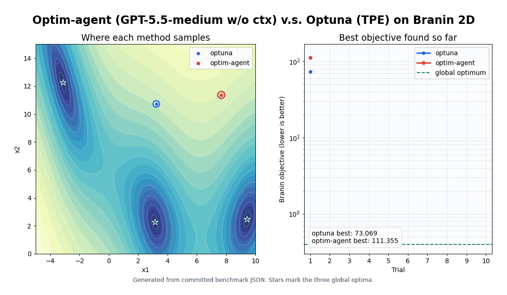
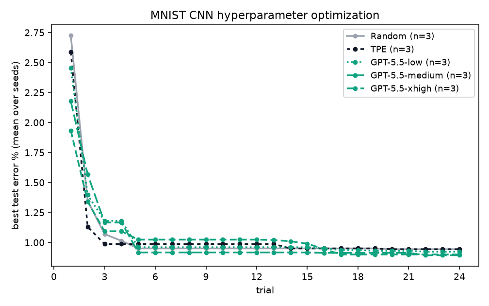
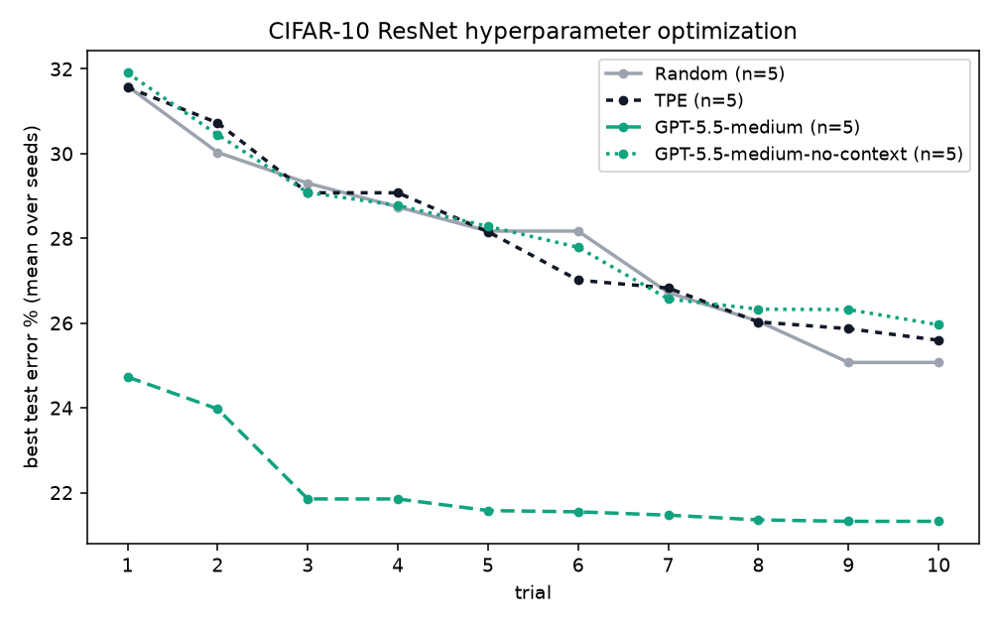
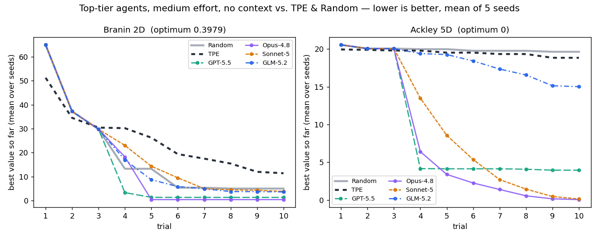

<p align="center">
  <picture>
    <source media="(prefers-color-scheme: dark)" srcset="docs/assets/optim-agent-logo-dark.svg">
    
  </picture>
</p>

<h1 align="center">optim-agent</h1>

<p align="center">
  <strong>LLM agents as your hyperparameter optimizer.</strong><br>
  A context-aware, agent-driven drop-in for Optuna — for tuning any machine-learning or deep-learning training run.
</p>

<p align="center">
  <a href="https://pypi.org/project/optim-agent/"></a>
  <a href="https://pypi.org/project/optim-agent/"></a>
  <a href="LICENSE"></a>
  
</p>

Instead of an evolutionary algorithm or a Bayesian surrogate, optim-agent hands
the *choose-the-next-point* decision to a coding agent (Claude Code, Codex, or
OpenCode) that reasons both **qualitatively** — what a learning rate or a
lookback window *means* — and **quantitatively** — what the trial history
*shows*. No API keys, no extra services: if the agent CLI runs on your machine,
optim-agent can drive it.

## Why optim-agent

- 🧠 **Agent-friendly by design** — the optimizer *is* an LLM agent. Point it at
  `claude`, `codex`, or `opencode`; it reads the trial history and reasons about
  the next configuration like a practitioner would.
- 🎯 **Context-aware** — tell it what each knob *means* (`context="learning rate
  for a CNN"`) and it optimizes with domain priors, not blind point-picking.
- ⚡ **More efficient** — reaches good configs in a handful of trials where
  classical HPO needs a warm-up; the agent pruner kills doomed runs early to
  save compute.
- 🏆 **More effective** — at small budgets (10 trials) top agents hit the optimum
  of standard benchmark functions while TPE and random search don't yet. See
  [Benchmarks](#benchmarks-agents-vs-tpe-and-random-search).
- 🔧 **A general ML/DL training helper** — a drop-in `create_study` /
  `suggest_float` / `optimize` API that wraps *any* training loop, plus a
  [skill](skills/optim-agent/SKILL.md) where the agent reads your code first.
- 📦 **Zero runtime dependencies** — pure stdlib; agents are called through their
  own CLIs. Nothing to host, no keys to manage.

## What you get in practice

- **Small-budget leverage** — useful when each trial is expensive and classical
  surrogates are still data-starved.
- **Semantic tuning** — combines parameter meanings, study context, and trial
  history instead of treating every knob as an anonymous coordinate.
- **Auditable decisions** — records the context, proposals, outcomes, and
  optional agent rationales that matter in high-stakes, risk-managed ML
  workflows.
- **Bounded autonomy** — the agent proposes, optim-agent validates, and your
  objective decides; invalid agent output falls back to safe sampling.
- **Drop-in deployment** — Optuna-style API, JSON/SQLite storage, local
  authenticated CLI backends, and zero runtime dependencies.

## Watch the search unfold



This seed-0 Branin trace shows where TPE and GPT-5.5 sample under the same
10-trial budget, alongside the incumbent objective after each trial. It is a
trajectory illustration, not the aggregate benchmark; the multi-seed results
and reproduction commands are below. Regenerate it from committed JSON with
`python scripts/render_trajectory.py`.

**Full documentation:** [docs/index.html](docs/index.html) — served as a
website via GitHub Pages (Settings → Pages → deploy from branch, `main` /`docs`).

## Install

```bash
pip install optim-agent
```

Plus at least one agent CLI on your PATH, already authenticated:
[claude](https://docs.anthropic.com/en/docs/claude-code),
[codex](https://github.com/openai/codex), or
[opencode](https://github.com/sst/opencode).

## Quickstart

```python
import optim_agent as oa

def objective(trial):
    lr = trial.suggest_float("lr", 1e-5, 1e-1, log=True,
                             context="learning rate for training an image classifier")
    batch = trial.suggest_int("batch", 8, 256, log=True,
                              context="mini-batch size; larger is more stable but slower")
    return train_and_validate(lr, batch)          # your code

study = oa.create_study(
    direction="minimize",
    sampler=oa.AgentSampler(
        backend="claude",                          # or "codex" / "opencode"
        effort="high",                             # low | medium | high
        context="a CNN on MNIST",                  # study-wide description (optional)
    ),
    storage="study.json",                          # optional: persist & resume
)
study.optimize(objective, n_trials=20)
print(study.best_value, study.best_params)
```

`context` is optional but powerful: it tells the agent what the parameters
*are*, so it can reason like a practitioner ("loss diverged at lr=0.1 with a
small batch — try 3e-4 and a larger batch") instead of a blind point-picker.
Set it study-wide on `AgentSampler(context=...)`, per-parameter on each
`suggest_*(..., context=...)`, or both — every piece is shown to the agent.

## Benchmarks: agents vs. TPE and random search

All refreshed comparisons use the same four candidates: **Random**, Optuna
**TPE**, **GPT-5.5 medium**, and **GPT-5.5 medium without context**. Each curve
is the mean of **5 fresh seeds** (`0..4`) at **10 trials**. Codex is explicitly
pinned to `gpt-5.5` with `model_reasoning_effort=medium`; no CLI-default model
is used.

For classification, the primary metric rewards fast improvement:

```text
reward = sum(best_test_error_so_far_at_i for i in 1..10)
```

Lower is better. The context-enabled run receives the study description, the
declared 16-dimensional space, and parameter meanings. The no-context run
receives none of those additions. Neither run uses hand-picked anchors.

### MNIST ResNet, 16 dimensions



| method | mean reward ↓ | mean final best error ↓ |
|---|---:|---:|
| Random | 9.174 | 0.648% |
| TPE | 7.166 | 0.580% |
| **GPT-5.5 medium** | **5.668** | **0.506%** |
| GPT-5.5 medium, no context | 8.910 | 0.632% |

GPT-5.5 medium reduces reward by **20.9%** relative to the best baseline, TPE.
Without context it is 24.3% worse than TPE, isolating the value of semantic
parameter information rather than model identity.

The 16 dimensions in [`examples/mnist.py`](examples/mnist.py) are learning
rate, batch size, weight decay, label smoothing, three stage widths, three
stage depths, four dropout controls, translation radius, and rotation range.

### CIFAR-10 ResNet, 16 dimensions



| method | mean reward ↓ | mean final best error ↓ |
|---|---:|---:|
| Random | 278.920 | 25.072% |
| TPE | 279.936 | 25.596% |
| **GPT-5.5 medium** | **220.994** | **21.322%** |
| GPT-5.5 medium, no context | 281.466 | 25.960% |

GPT-5.5 medium reduces reward by **20.8%** relative to the best baseline,
Random. Without context it is 0.9% worse than Random.

The matched 16-dimensional space in
[`examples/cifar10.py`](examples/cifar10.py) tunes learning rate, batch size,
weight decay, label smoothing, three stage widths, three stage depths, four
dropout controls, crop padding, and flip probability.

### Branin and Ackley-5D



| method | mean best Branin ↓ | mean best Ackley-5D ↓ |
|---|---:|---:|
| Random | 5.008 | 19.639 |
| TPE | 8.219 | 19.419 |
| GPT-5.5 medium | **0.398** | **0.000** |
| GPT-5.5 medium, no context | **0.398** | **0.000** |

Both GPT variants solve these standard functions, so they demonstrate
small-budget optimization but do not measure the value of context. The two
classification tasks provide that separation.

Reproduce the distributed runs (the `examples` extra installs Optuna):

```bash
pip install -e ".[examples]"

# Ten classification workers: 2 datasets × 5 seeds. Run no-context first so
# the default verifier can report all four candidates after baselines/context.
python scripts/verify_classification_reward.py run-no-context
python scripts/verify_classification_reward.py

# Four candidates; each candidate runs five seeds concurrently.
python examples/hard_functions.py distributed --trials 10 --seeds 0 1 2 3 4
python examples/hard_functions.py plot
```

## Usage guide

### Sampler effort

| effort | history shown | explicit reasoning | qualitative notes |
|---|---|---|---|
| `low` | last 5 trials | – | – |
| `medium` | last 10 trials | ✓ | – |
| `high` | last 20 trials | ✓ | ✓ carried across trials |

Higher effort spends more tokens per trial. For fast objectives, `low` or plain
`RandomSampler()` may be all you need.

### Pruning

```python
study = oa.create_study(
    sampler=oa.AgentSampler(backend="codex"),
    pruner=oa.AgentPruner(backend="codex", level="medium"),  # loose | medium | tight
)

def objective(trial):
    lr = trial.suggest_float("lr", 1e-5, 1e-1, log=True,
                             context="learning rate for training an image classifier")
    for epoch in range(20):
        loss = train_one_epoch(lr)
        trial.report(loss, epoch)
        if trial.should_prune():
            raise oa.TrialPruned()
    return loss
```

The pruner agent compares the current learning curve against completed trials
and answers prune/keep; `loose` intervenes only on hopeless runs, `tight`
kills anything underperforming. It never prunes on an agent error.

### Concurrency & distributed studies

Set `max_concurrency` (default `1`) to evaluate several trials at once, and use
a SQLite `storage` file (`.db` / `.sqlite`) as the concurrency-safe shared
history:

```python
study = oa.create_study(
    sampler=oa.AgentSampler(backend="claude"),
    storage="study.db",        # SQLite → safe for many workers; .json stays single-writer
    max_concurrency=8,         # up to 8 objectives run at once
)
study.optimize(objective, n_trials=100)
```

- **Within a process**, `max_concurrency` runs objectives in a thread pool. The
  agent sampling queries are **queued** (serialized) so each proposal sees the
  in-process history; only your `objective` runs in parallel — ideal when it is
  I/O- or subprocess-bound (training a model, hitting an API).
- **Across processes / machines**, point them all at the same SQLite `storage`.
  The database *is* the communication channel: WAL mode lets every worker append
  results and read history without clobbering, and trial numbers stay unique.

Ceilings (deliberate): threads share the GIL, so pure-Python CPU-bound
objectives won't speed up — spread those over processes via shared SQLite
instead. Concurrent workers don't see each other's *in-flight* points, so they
may occasionally probe nearby regions; that is the normal cost of parallel HPO.

### Skill mode (agent reads your code)

The pip package treats your objective as a blackbox. The
[optim-agent skill](skills/optim-agent/SKILL.md) goes further: installed into a
coding-agent session, the agent first *reads your project* to understand each
hyperparameter's role, then drives the same study loop itself via
`study.ask(params)` / `study.tell(trial, value)` — with the study JSON keeping
history across sessions.

```python
trial = study.ask({"lr": 3e-4, "batch": 64})   # the session agent picks the point
study.tell(trial, run_training(**trial.params))
```

### Offline testing

`AgentSampler(backend="mock")` is a token-free stand-in (hill climbing around
the best point) so you can wire everything up before spending agent calls.

## Troubleshooting

- **`claude` returns 401 inside an agent session** — nested sessions inherit
  `ANTHROPIC_API_KEY`; run with `env -u ANTHROPIC_API_KEY` or from a clean shell.
- **A backend call times out or emits garbage** — the sampler warns and falls
  back to a random point for that trial; the study keeps going.

## Contributing

Contributions are welcome. To develop locally:

```bash
pip install -e ".[examples]"
pytest                     # runs tests/test_optim_agent.py
```

Please open an issue to discuss larger changes before sending a PR. Adding a new
agent backend usually means one small function in [`optim_agent/agent.py`](optim_agent/agent.py).

## Paper

An arXiv paper with extended experiments (MNIST classification, ARIMA
time-series fitting, baseline and ablation studies) is in preparation under
[`paper/`](paper/README.md).

## License

[MIT](LICENSE)
