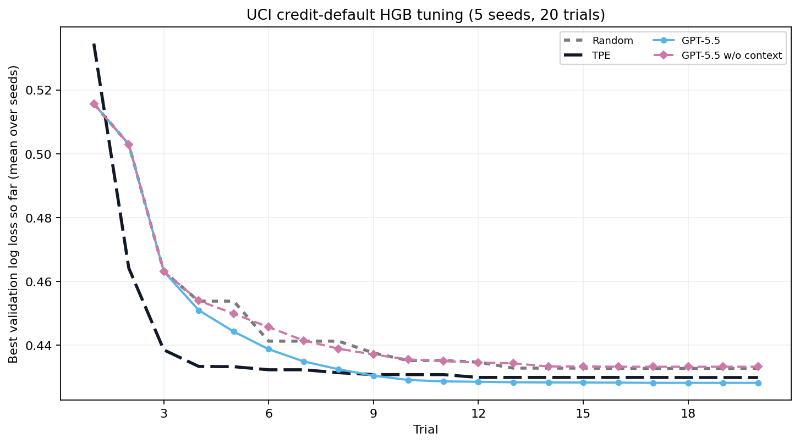

<p align="center">
  <picture>
    <source media="(prefers-color-scheme: dark)" srcset="../assets/optim-agent-logo-dark.svg">
    
  </picture>
</p>

<h1 align="center">optim-agent</h1>

<p align="center">
  <strong>Agentische Systemoptimierung mit Coding-Agenten.</strong><br>
  Automatisiert die iterative Parameterabstimmung eines Algorithmus-Engineers.
</p>

<p align="center">
  <a href="../../README.md">English</a> |
  <a href="README_ZH.md">简体中文</a> |
  <a href="README_JA.md">日本語</a> |
  <a href="README_KO.md">한국어</a> |
  <a href="README_FR.md">Français</a> |
  <strong>Deutsch</strong> |
  <a href="README_ES.md">Español</a> |
  <a href="README_PT.md">Português</a> |
  <a href="README_RU.md">Русский</a>
</p>

optim-agent nutzt Claude Code, Codex oder OpenCode, um jedes System mit
**konfigurierbaren Parametern** und einem **messbaren Ziel** zu optimieren. Das
Werkzeug verbindet die Bedeutung der Parameter mit dem bisherigen
Versuchsverlauf und schlägt die nächste auszuwertende Konfiguration vor. Ihre
Zielfunktion bleibt entscheidend; ungültige Antworten werden geprüft und durch
sicheres Sampling ersetzt.

## Warum optim-agent

- **Semantische Vorschläge**: Der Agent berücksichtigt Parameterbedeutungen,
  Studienkontext und beobachtete Ergebnisse statt nur anonyme Koordinaten.
- **Stark bei kleinen Budgets**: Geeignet, wenn Auswertungen teuer sind und
  klassischen Surrogatmodellen noch Daten fehlen.
- **Nachvollziehbar**: Konfigurationen, Ergebnisse, Zustände, Kontext und
  optionales Agenten-Rationale werden in JSON oder SQLite gespeichert.
- **Begrenzte Ausführung**: Der Agent schlägt nur Werte vor; der Suchraum
  validiert sie und die Zielfunktion entscheidet über das Ergebnis.

## Installation

Wählen Sie entweder die stabile PyPI-Version oder den neuesten GitHub-Stand:

```bash
# Stabile Version von PyPI
python -m pip install optim-agent

# Neuester Quellstand von GitHub
python -m pip install "optim-agent @ git+https://github.com/Optim-Agent/optim-agent.git"
```

Zusätzlich muss ein authentifiziertes `claude`-, `codex`- oder `opencode`-CLI im PATH liegen.

## Schnellstart

```python
import optim_agent as oa

def objective(trial):
    threshold = trial.suggest_float(
        "threshold", 0.05, 0.95,
        context="decision threshold; higher values trade recall for precision",
    )
    budget = trial.suggest_int(
        "budget", 10, 200, log=True,
        context="compute or operating budget",
    )
    return evaluate_system(threshold=threshold, budget=budget)

study = oa.create_study(
    direction="maximize",
    sampler=oa.AgentSampler(
        backend="codex",  # alternativ "claude" / "opencode"
        effort="high",
        context="maximize quality under a strict operating-cost budget",
    ),
    storage="study.json",
)
study.optimize(objective, n_trials=20)
print(study.best_value, study.best_params)
```

`context` ist optional, aber wirkungsvoll. Beschreiben Sie das Gesamtsystem und
die Bedeutung jedes `suggest_*`-Parameters, damit der Agent wie ein
Algorithmus-Engineer statt wie ein blinder Punktsucher schlussfolgern kann.

## Skill-Modus

Der Paketmodus behandelt das Ziel als Blackbox. Mit der
[`SKILL.md`](../../SKILL.md) im Repository-Stamm liest der aktive Coding-Agent
zuerst das Projekt und versteht die Parameterbeziehungen. Danach steuert er
dieselbe Studie mit `study.ask(params)` und `study.tell(trial, value)`. Installieren
Sie den Skill in Codex direkt von GitHub:

```text
$skill-installer install https://github.com/Optim-Agent/optim-agent
```

## Einsatzgebiete

| Bereich | Beispielparameter | Beispielziele |
|---|---|---|
| Modelltraining | Lernraten, Architekturen, Augmentierung, Regularisierung | Qualität, Rechenaufwand, Robustheit |
| Inferenz und Serving | Quantisierung, Batching, Decoding, Caching, Routing | Qualität, Latenz, Durchsatz, Kosten |
| Quantitative Forschung | Signalfenster, Schwellenwerte, Rebalancing, Risikoregeln | Walk-forward-Rendite, Drawdown, Turnover |
| Reinforcement Learning | Zielgewichte, Explorationspläne, Policy-Schwellen | Return, Sicherheit, Sample-Effizienz |
| Wissenschaftliche Abläufe | Simulationseingaben, Solver, Versuchssteuerung | Fit, Fehler, Laufzeit, Ressourcen |
| Black-Box-Systeme | jede begrenzte kategoriale, ganzzahlige oder stetige Konfiguration | jeder messbare Skalarwert |

## Benchmarks

### Mathematische Funktionen ohne Kontext optimieren: Branin-2D und Ackley-5D

Agenten für harte Funktionen erhalten **keinen bereitgestellten Task-Kontext**: nur generische Parameternamen `x1...x5`, numerische Grenzen und Trial-Historie. Alle Agenten verwenden medium effort, 10 Trials und fünf Seeds; Random und TPE bleiben unveränderte Baselines.

#### Top-tier Agents


| Methode | mittlerer bester Branin ↓ | mittlerer bester Ackley-5D ↓ |
|---|---:|---:|
| Random | 5.008 | 19.639 |
| TPE | 11.395 | 18.843 |
| GPT-5.5 | 1.326 | 3.960 |
| **Opus-4.8** | **0.398** | **0.061** |
| Sonnet-5 | 3.850 | 0.143 |
| GLM-5.2 | 3.609 | 15.023 |

#### OpenCode Agents (Free)


| Methode | mittlerer bester Branin ↓ | mittlerer bester Ackley-5D ↓ |
|---|---:|---:|
| Random | 5.008 | 19.639 |
| TPE | 11.395 | 18.843 |
| Big-pickle | 4.734 | 15.951 |
| DeepSeek-V4-Flash | 4.410 | **4.608** |
| Nemotron-3-Ultra | 16.051 | 18.459 |
| **MiMo-v2.5** | **3.682** | 15.597 |

### ResNet-Bildklassifikatoren tunen: MNIST und CIFAR-10


Random, Optuna TPE, **GPT-5.5 w/ context** und **GPT-5.5 w/o context** werden über fünf Seeds (`0..4`) und 10 Trials verglichen. Beide GPT-5.5-Varianten pinnen `gpt-5.5` mit medium reasoning effort (`model_reasoning_effort=medium`); nur **GPT-5.5 w/ context** erhält natürlichsprachliche Beschreibungen des Study-Ziels und aller 16 Parameter.

| Methode | MNIST kumulativer Fehler ↓ | MNIST finaler Fehler ↓ | CIFAR-10 kumulativer Fehler ↓ | CIFAR-10 finaler Fehler ↓ |
|---|---:|---:|---:|---:|
| Random | 9.174 | 0.648% | 278.920 | 25.072% |
| TPE | 7.166 | 0.580% | 279.936 | 25.596% |
| **GPT-5.5 w/ context** | **5.668** | **0.506%** | **220.994** | **21.322%** |
| GPT-5.5 w/o context | 8.910 | 0.632% | 281.466 | 25.960% |

### Gradient-Boosting-Klassifikator tunen: Kreditausfallwahrscheinlichkeiten



Dieser CPU-only Benchmark tuned acht Trainingsparameter eines `HistGradientBoostingClassifier` auf UCI **Default of Credit Card Clients** (30.000 Zeilen, 23 Merkmale, CC BY 4.0). Alle Methoden nutzen dieselbe Aufteilung, 20 Trials und Seeds `0..4`.

| Methode | finaler Validierungs-Log-Loss ↓ | Holdout-Test-Log-Loss ↓ |
|---|---:|---:|
| Random | 0.433 | 0.425 |
| TPE | 0.430 | **0.422** |
| **GPT-5.5 w/ context** | **0.428** | **0.422** |
| GPT-5.5 w/o context | 0.433 | 0.427 |

Kontext senkt mit der ausgewählten GPT-5.5-Konfiguration den finalen Validierungs-Log-Loss um 1,16% und den Holdout-Test-Log-Loss um 1,15% gegenüber der passenden No-Context-Kontrolle. Dies ist ein methodischer Benchmark, kein produktives Kreditentscheidungssystem.

Weitere Beispiele:

- [Inferenz-Tuning](../../examples/inference_tuning.py)
- [scikit-learn-Tuning](../../examples/sklearn_tuning.py)
- [MNIST](../../examples/mnist.py) / [CIFAR-10](../../examples/cifar10.py)

## Aktuelle Grenzen

- Derzeit wird ein einzelnes Ziel unterstützt. Für mehrere Ziele muss explizit
  eine skalare Nutzenfunktion oder eine Constraint-Strafe definiert werden.
- Bei sehr günstigen Auswertungen mit Tausenden möglichen Versuchen können TPE,
  Gaußprozesse oder evolutionäre Verfahren geeigneter sein.
- Für Reproduzierbarkeit sollten Seeds fixiert und vollständige Studien gespeichert werden.

## Fehlerbehebung

- **OpenCode und verteilte Studien**: OpenCode unterstützt derzeit den
  `distributed computing`-Ablauf von optim-agent nicht. Verwenden Sie den
  Einzelprozess-Ablauf oder ein anderes Backend für verteilte Läufe.

## Mitwirken

Beiträge sind willkommen. Größere Änderungen bitte vor einem Pull Request in
einem Issue diskutieren. Das [englische README](../../README.md) ist die
maßgebliche Quelle für Versionen, Benchmarkwerte und unterstützte Backends.

## Danksagung

- [Optuna](https://github.com/optuna/optuna) für die Verbreitung der
  Study/Trial-Schnittstelle und die in Beispielen und Benchmarks verwendete TPE-Baseline.
- [OpenCode](https://github.com/sst/opencode) für den Zugang zu den kostenlosen
  Modellen, die in den Benchmarks schwieriger Funktionen ausgewertet wurden.

## Lizenz

[MIT](../../LICENSE)
