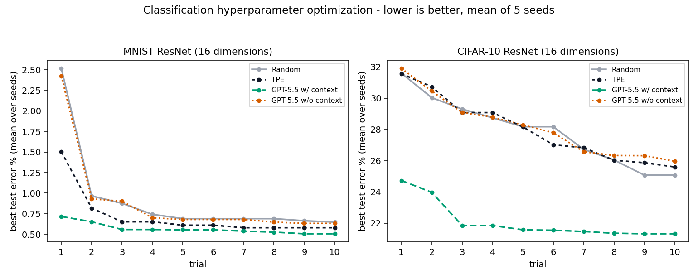

<p align="center">
  <picture>
    <source media="(prefers-color-scheme: dark)" srcset="../assets/optim-agent-logo-dark.svg">
    
  </picture>
</p>

<h1 align="center">optim-agent</h1>

<p align="center">
  <strong>Optimisation agentique de systèmes avec des agents de programmation.</strong><br>
  Automatisez le réglage itératif des paramètres effectué par un ingénieur algorithmique.
</p>

<p align="center">
  <a href="../../README.md">English</a> |
  <a href="README_ZH.md">简体中文</a> |
  <a href="README_JA.md">日本語</a> |
  <a href="README_KO.md">한국어</a> |
  <strong>Français</strong> |
  <a href="README_DE.md">Deutsch</a> |
  <a href="README_ES.md">Español</a> |
  <a href="README_PT.md">Português</a> |
  <a href="README_RU.md">Русский</a>
</p>

optim-agent utilise Claude Code, Codex ou OpenCode pour optimiser tout système
qui expose des **paramètres configurables** et un **objectif mesurable**. Il
combine le sens de chaque paramètre avec l'historique des essais, puis propose
la prochaine configuration à évaluer. Votre fonction objectif reste l'unique
arbitre ; les réponses invalides sont contrôlées et remplacées par un
échantillonnage sûr.

## Pourquoi optim-agent

- **Propositions sémantiques** : l'agent raisonne sur le sens des paramètres,
  le contexte de l'étude et les résultats observés.
- **Efficace avec un petit budget** : utile lorsque chaque évaluation est
  coûteuse et que les modèles de substitution classiques manquent de données.
- **Traçable** : configurations, résultats, états, contexte et raisonnement
  facultatif sont conservés en JSON ou SQLite.
- **Exécution bornée** : l'agent propose seulement des valeurs ; l'espace de
  recherche les valide et la fonction objectif décide du résultat.

## Installation

```bash
pip install optim-agent
```

Ajoutez aussi à votre PATH un CLI `claude`, `codex` ou `opencode` déjà authentifié.

## Démarrage rapide

```python
import optim_agent as oa

def objective(trial):
    threshold = trial.suggest_float(
        "threshold", 0.05, 0.95,
        context="decision threshold; higher values trade recall for precision",
    )
    budget = trial.suggest_int(
        "budget", 10, 200, log=True,
        context="compute or operating budget",
    )
    return evaluate_system(threshold=threshold, budget=budget)

study = oa.create_study(
    direction="maximize",
    sampler=oa.AgentSampler(
        backend="codex",  # ou "claude" / "opencode"
        effort="high",
        context="maximize quality under a strict operating-cost budget",
    ),
    storage="study.json",
)
study.optimize(objective, n_trials=20)
print(study.best_value, study.best_params)
```

`context` est facultatif mais puissant. Décrivez le système global et chaque
paramètre `suggest_*` pour permettre à l'agent de raisonner comme un ingénieur
algorithmique plutôt que comme un simple explorateur de points.

## Domaines d'application

| Domaine | Exemples de paramètres | Exemples d'objectifs |
|---|---|---|
| Entraînement de modèles | taux d'apprentissage, architectures, augmentation, régularisation | qualité, calcul, robustesse |
| Inférence et service | quantification, lots, décodage, cache, routage | qualité, latence, débit, coût |
| Recherche quantitative | fenêtres de signal, seuils, rééquilibrage, contrôle du risque | rendement walk-forward, drawdown, rotation |
| Apprentissage par renforcement | poids d'objectifs, exploration, seuils de politique | retour, sécurité, efficacité d'échantillonnage |
| Recherche scientifique | entrées de simulation, solveurs, contrôles expérimentaux | ajustement, erreur, temps, ressources |
| Systèmes boîte noire | toute configuration bornée catégorielle, entière ou continue | toute valeur scalaire mesurable |

## Benchmarks



Les comparaisons utilisent le même espace de recherche, le même budget et les
mêmes graines pour Random, Optuna TPE et les agents avec ou sans contexte. Les
valeurs exactes, la méthode et les commandes de reproduction se trouvent dans
le [README anglais](../../README.md#benchmarks-agents-vs-tpe-and-random-search),
qui fait foi.

Autres exemples :

- [Réglage de l'inférence](../../examples/inference_tuning.py)
- [Réglage walk-forward de signaux quantitatifs](../../examples/quant_walk_forward.py)
- [Réglage scikit-learn](../../examples/sklearn_tuning.py)
- [MNIST](../../examples/mnist.py) / [CIFAR-10](../../examples/cifar10.py)

## Limites actuelles

- L'optimisation est actuellement mono-objectif. Pour plusieurs objectifs,
  définissez explicitement une utilité scalaire ou des pénalités de contrainte.
- Pour des évaluations très bon marché autorisant des milliers d'essais, TPE,
  les processus gaussiens ou les méthodes évolutionnaires peuvent être préférables.
- Pour la reproductibilité, fixez les graines et conservez l'étude complète.

## Contribution

Les contributions sont bienvenues. Discutez des changements importants dans
une issue avant d'ouvrir une Pull Request. Le [README anglais](../../README.md)
est la référence pour les versions, les résultats et les backends pris en charge.

## Remerciements

- [Optuna](https://github.com/optuna/optuna), qui a popularisé l'interface
  Study/Trial et fournit la référence TPE utilisée dans les exemples et benchmarks.

## Licence

[MIT](../../LICENSE)
